

  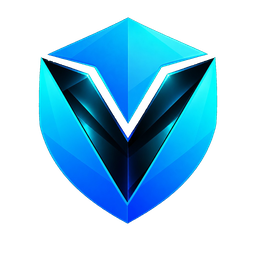

<h1 align="center">Veydan Space</h1>

  <b>One workspace for many accounts.</b> 
  Isolated browser profiles, proxies, SSH, notes, passwords and chat — in one local-first app.

  
  
  

  <a href="https://github.com/veydanproject/Veydan-Space/releases/latest"><b>Download</b></a> ·
  <a href="#features">Features</a> ·
  <a href="#on-your-phone">On your phone</a> ·
  <a href="#privacy-and-security">Privacy</a> ·
  <a href="docs/DEVELOPMENT.md">Build from source</a>

<picture>
  <source media="(prefers-color-scheme: dark)" srcset="docs/images/hero-dark.jpg">
  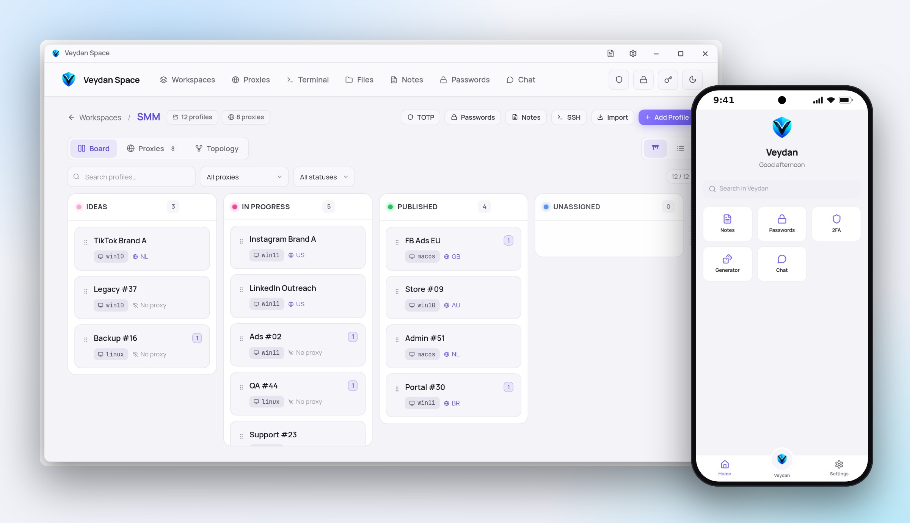
</picture>

> [!IMPORTANT]
> **Upgrading from Veydan Space 4?** Read the
> [v4 → v5 migration guide](docs/MIGRATION-V4-V5.md) before installing
> (English · Русский).

## Why Veydan Space

If you run many accounts, proxies and servers at once, your day is spread
across a dozen tools. Veydan Space puts it in one window: every account gets
its own isolated browser identity, every proxy and server is one click away,
and the notes, passwords and one-time codes of a project sit right next to
it.

- **Everything about a project in one place** — profiles, proxies, servers,
  notes, passwords and 2FA, grouped into workspaces.
- **Accounts that never touch each other** — each browser profile is a
  separate identity with its own fingerprint, cookies and proxy.
- **Local-first** — your data lives on your computer. No account with us,
  no telemetry.
- **Your own sync** — through your folder, S3 bucket or WebDAV, end-to-end
  encrypted. We never see your data, because it never comes to us.

## Features

### Workspaces

Group profiles by client, project or team. Each workspace has its color,
icon and notes, and three views: a **Kanban board** whose columns come from
your tags, a **table**, and a **topology graph** of profiles and their
proxies.

<picture>
  <source media="(prefers-color-scheme: dark)" srcset="docs/images/screen-home-dark.png">
  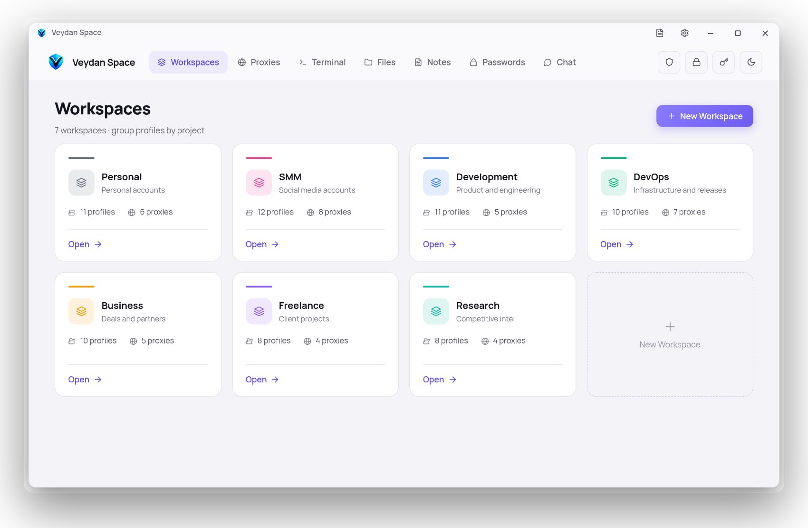
</picture>

<picture>
  <source media="(prefers-color-scheme: dark)" srcset="docs/images/screen-topology-dark.png">
  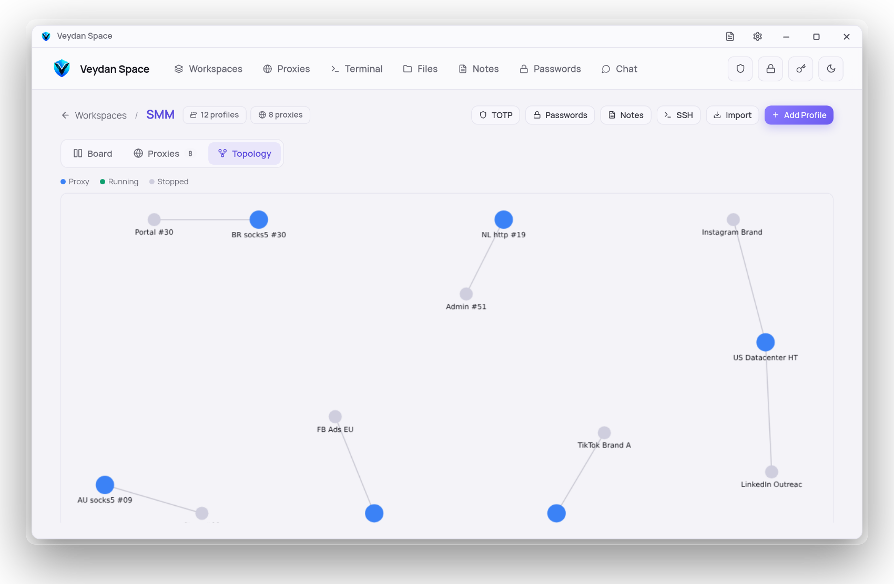
</picture>

### Isolated browser profiles

Profiles run in [Camoufox](https://camoufox.com/), a hardened Firefox built
against fingerprinting. Every profile is its own identity, so accounts never
cross-contaminate:

- **Fingerprint per profile** — canvas, audio and font noise, WebGL vendor
  and renderer, screen, navigator properties.
- **OS presets** — Windows 10, Windows 11, macOS and Linux, each with a
  matching user agent and platform.
- **Timezone, locale and languages, screen size, WebRTC policy and
  geolocation** — set per profile.
- **Its own proxy, cookies, search engine and color stripe** in the browser
  window, so windows are easy to tell apart.
- **Cookie import and export** (EditThisCookie format) and **profile
  export/import** as portable ZIP archives.
- Camoufox is **downloaded and updated for you**.

<picture>
  <source media="(prefers-color-scheme: dark)" srcset="docs/images/screen-profile-dark.png">
  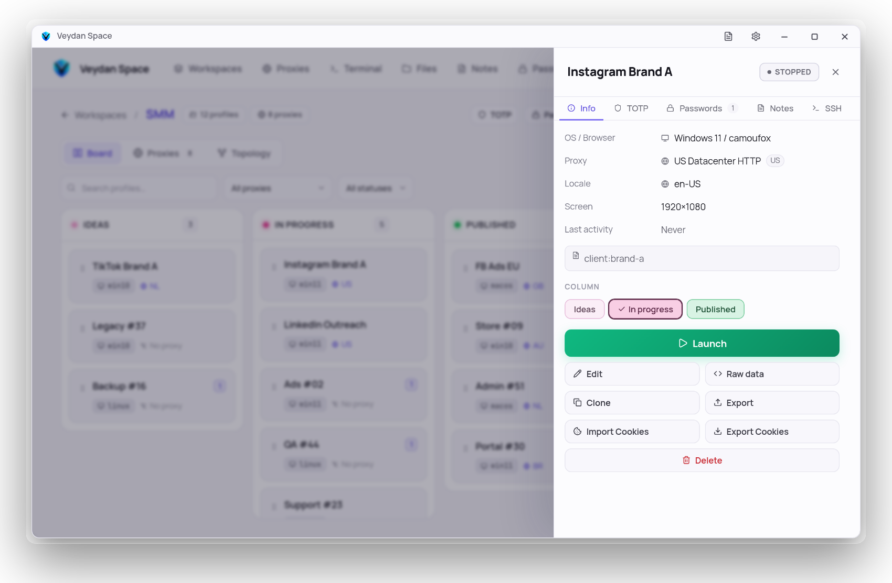
</picture>

<picture>
  <source media="(prefers-color-scheme: dark)" srcset="docs/images/screen-profile-edit-dark.png">
  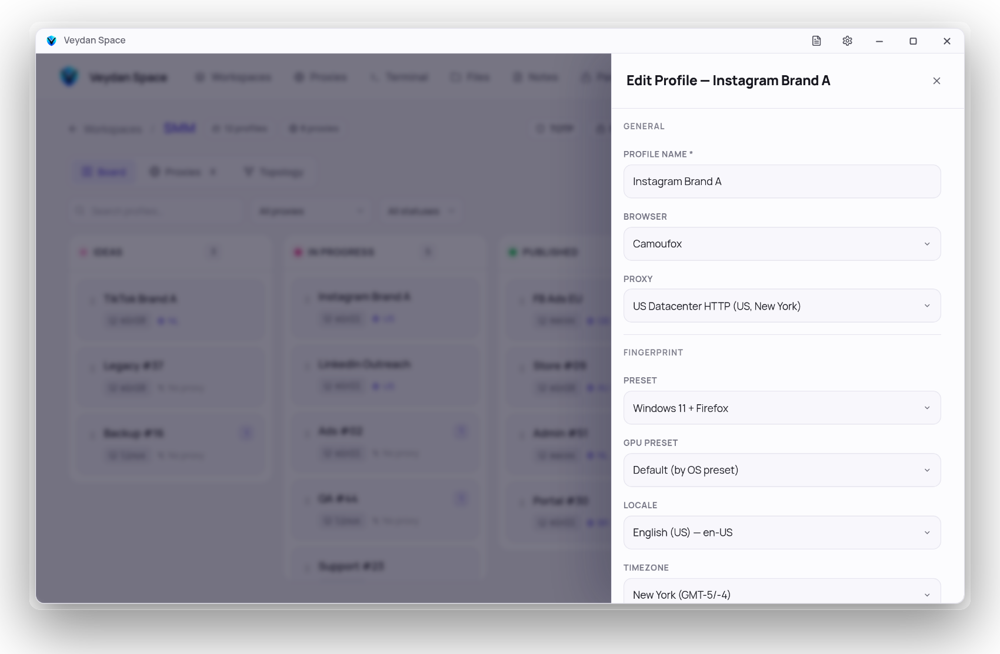
</picture>

### Proxies

HTTP, HTTPS, SOCKS5, SSH and Tor proxies with credentials, country and city
labels and tags. **One-click check** shows the exit IP and location.
**Bulk import** takes a pasted list in the usual formats and checks every
line before saving. Proxy settings **fail closed**: if a profile's proxy is
missing, the profile does not connect directly and expose your real IP.

<picture>
  <source media="(prefers-color-scheme: dark)" srcset="docs/images/screen-proxies-dark.png">
  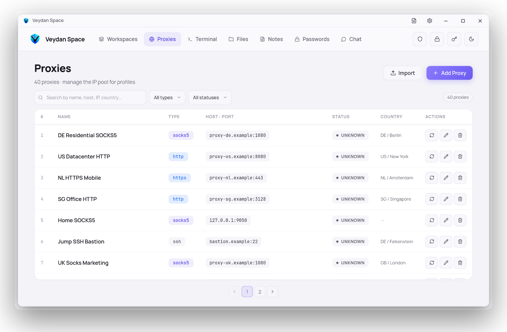
</picture>

### SSH terminal and file manager

A complete SSH client, not just a tunnel:

- **Saved connections** with password, key or key + passphrase.
- **SSH key manager** — generate Ed25519, RSA and ECDSA keys or import your
  own.
- **2FA auto-fill** — link a connection to a TOTP secret and the app answers
  the one-time-code prompt for you.
- **Through a proxy or a jump host** — SOCKS5, HTTP or another SSH server,
  with host keys pinned on first use.
- **Many sessions at once**, a real terminal with resize, links and
  scrollback.
- **Dual-pane SFTP file manager** — copy and move in any direction, resume
  interrupted transfers, permissions, keyboard shortcuts.

<picture>
  <source media="(prefers-color-scheme: dark)" srcset="docs/images/screen-ssh-dark.png">
  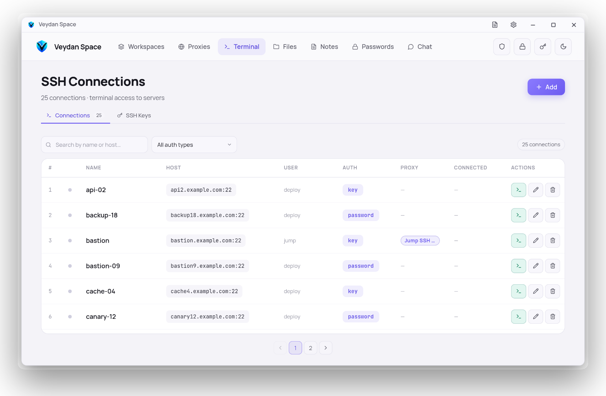
</picture>

### Notes

Markdown notes with folders, colored tags, pins and archive, full-text
search, attachments, **version history with diff, restore and three-way
merge**, and crash-safe drafts. Notes are plain Markdown files on your disk,
and a note can be attached to a workspace or a profile so it shows up where
you need it. The same notes are in [Veydan Notes](https://github.com/veydanproject/Veydan-Notes).

<picture>
  <source media="(prefers-color-scheme: dark)" srcset="docs/images/screen-notes-dark.png">
  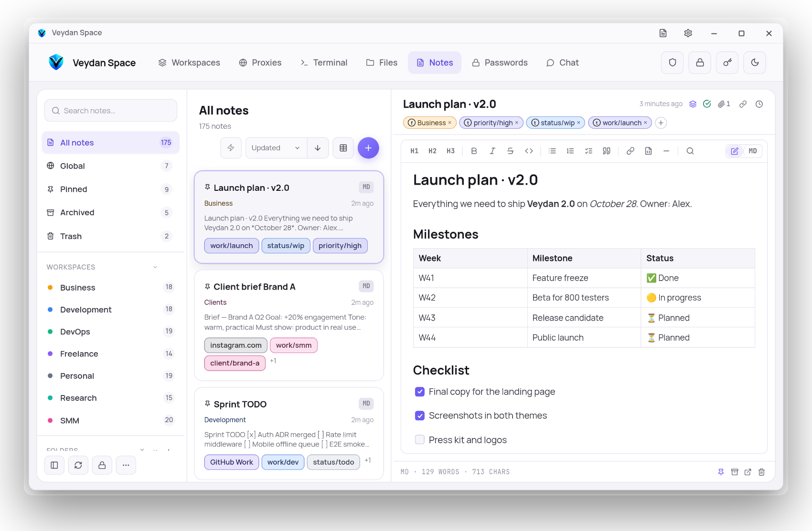
</picture>

### Passwords and 2FA

A password manager, a TOTP generator (Base32 secrets or `otpauth://` links,
SHA-1/256/512) and a password generator. Passwords can be linked to a
workspace or a profile. The same vault is in [Veydan Pass](https://github.com/veydanproject/Veydan-Pass).

<picture>
  <source media="(prefers-color-scheme: dark)" srcset="docs/images/screen-passwords-dark.png">
  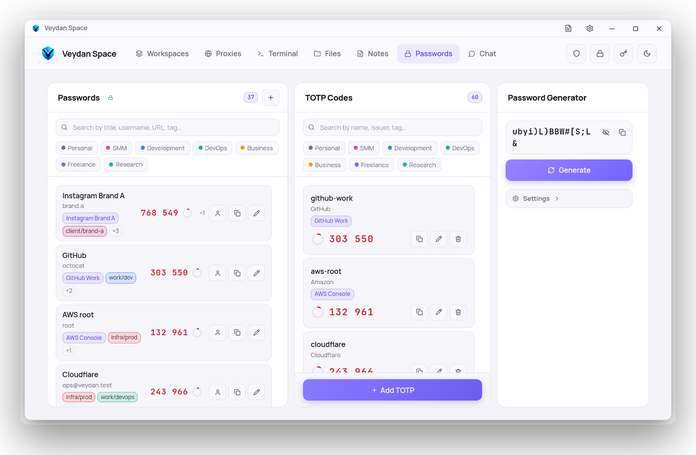
</picture>

### Chat

End-to-end encrypted chat on the Nostr protocol, built in: direct messages,
groups, photos, files and voice messages. No phone number — your identity is
a key only you hold. Also available on its own as
[Veydan Chat](https://github.com/veydanproject/Veydan-Chat).

### Sync, lock and the rest

- **Your own sync (beta)** — no Veydan cloud and no account. Point the app
  at a folder your cloud client already mirrors (Dropbox, Seafile…), an
  S3-compatible bucket (MinIO, R2…) or a WebDAV share. Everything is
  encrypted on the device before it leaves; one passphrase joins your other
  devices.
- **App lock** — PIN or password, auto-lock when you step away.
- **Automatic, signed updates.**
- **English and Russian**, light and dark themes.

## On your phone

Veydan Space for Android carries your notes, passwords, one-time codes, the
password generator and chat, synced with your computer.

<picture>
  <source media="(prefers-color-scheme: dark)" srcset="docs/images/phones-dark.png">
  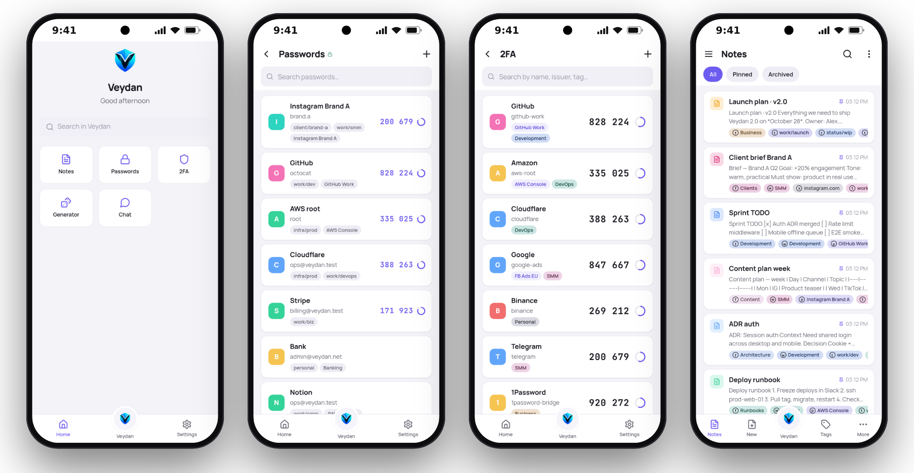
</picture>

## Download

Get the latest version from the
**[releases page](https://github.com/veydanproject/Veydan-Space/releases/latest)**.

| Platform | What to download |
|---|---|
| **Windows** 10 and 11 (x64) | the `.exe` installer (or the `.msi`) |
| **macOS** — Apple Silicon | the `.dmg` marked `aarch64` |
| **macOS** — Intel | the `.dmg` marked `x64` |
| **Linux** (x64) | `.AppImage`, or `.deb` / `.rpm` for your distribution |
| **Android** 8.0 and newer (64-bit ARM) | the `.apk` |

If macOS refuses to open the app on the first launch, right-click it and
choose **Open**.

The app updates itself when a new version comes out. Installed from a
`.deb` or `.rpm`? The app tells you about the new version, and you install it
from the releases page.

## Privacy and security

Local-first means your data is yours, on your disk. Here is exactly what
each protection does.

- **Sync storage only ever sees ciphertext.** Everything is encrypted on the
  device (XChaCha20-Poly1305, key from your passphrase via Argon2id) before
  it reaches your folder, bucket or WebDAV share.
- **Passwords are encrypted at rest** and decrypted only while the vault is
  open.
- **The rest of the local database is not encrypted at rest** — SSH
  passwords and keys, proxy credentials and TOTP secrets are stored in the
  local SQLite file, and notes are plain Markdown files. Use full-disk
  encryption: that is the layer that protects them.
- **The app lock protects the app, not the disk.** It locks the window and
  auto-locks on inactivity; it does not encrypt files.
- **Proxies fail closed** — a profile or SSH connection set to use a proxy
  never falls back to a direct connection.
- **No telemetry.**

## Where your data lives

| System | Folder |
|---|---|
| Windows | `%APPDATA%\net.veydan.space` |
| macOS | `~/Library/Application Support/net.veydan.space` |
| Linux | `~/.local/share/net.veydan.space` |

Run several independent copies side by side with `--workdir <folder>`: each
keeps everything in its own folder.

## The Veydan family

| | App | What it is |
|---|---|---|
|  | **Veydan Space** | Everything below in one workspace, plus browser profiles, proxies and SSH |
|  | [Veydan Notes](https://github.com/veydanproject/Veydan-Notes) | Markdown notes with end-to-end encrypted sync |
|  | [Veydan Pass](https://github.com/veydanproject/Veydan-Pass) | Passwords and one-time codes, encrypted and synced |
|  | [Veydan Chat](https://github.com/veydanproject/Veydan-Chat) | End-to-end encrypted chat on Nostr |

## Feedback

Found a bug or have an idea? [Open an issue](https://github.com/veydanproject/Veydan-Space/issues).
Developers: see [docs/DEVELOPMENT.md](docs/DEVELOPMENT.md) for building from
source.

## License

Copyright © 2026 **Veydan Project**.

Developed by **Rookbeam Technologies LLC**, USA.

Veydan Space is **source-available** software under the
[PolyForm Perimeter License 1.0.1](https://polyformproject.org/licenses/perimeter/1.0.1):
see [`LICENSE`](LICENSE), a summary in [`LICENSE-SUMMARY.md`](LICENSE-SUMMARY.md)
and the licences of what it is built from in
[`THIRD-PARTY-LICENSES.md`](THIRD-PARTY-LICENSES.md).
